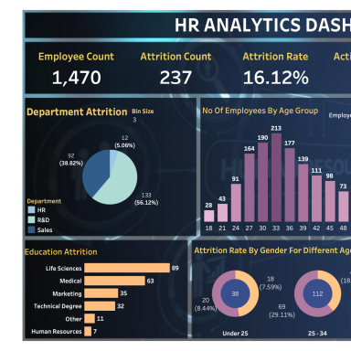
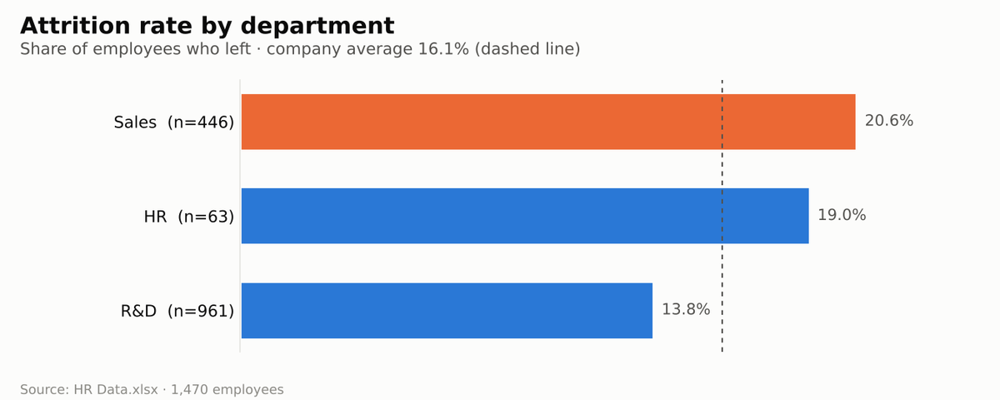
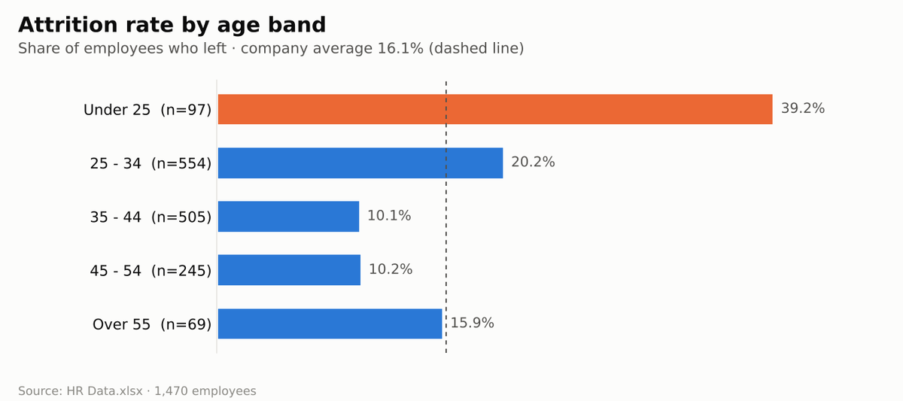

# 👥 HR Analytics Dashboard

**People Analytics | Tableau • Python • Statistics • Attrition • Workforce KPIs • Data Visualization**

An interactive **Tableau** dashboard that analyses employee attrition — who is leaving the company, from which departments, and what patterns sit behind it.


## 🌐 Live Report

**[scarface96.github.io/HR-Analysis-Dashboard](https://scarface96.github.io/HR-Analysis-Dashboard/)**

The Tableau workbook is still here. The same data now also drives a Python analysis that publishes an interactive web report, rebuilt by GitHub Actions on every push. No Tableau licence is needed to view it.

**What the Python analysis adds:**

- **Attrition with confidence ranges** by department, age, overtime and travel, so small groups aren't over-read
- **Overtime × seniority:** 53% of entry-level employees who work overtime have left (82 of 156), against 16% of their peers without overtime
- **Drivers model:** a logistic regression on 14 factors, shown as odds ratios. Overtime ×5.7, entry-level role ×4.7, poor work-life balance ×3.3, no stock options ×2.7. Being single and pay level stop mattering once seniority and stock are held equal. Cross-validated ROC AUC 0.83.
- **Early tenure:** staff with two years or less are 23% of the workforce but 43% of leavers
- **Satisfaction:** the risk sits in the lowest rating on each scale
- **Cost of attrition:** about $6.8M to replace everyone who left, at a cautious half-year's salary each
- **Segment explorer:** combine department, overtime, level, age, travel and stock filters to see a group's attrition, its 95% range, and its job-role breakdown

## Business value

Present employee attrition and workforce composition in a dashboard HR stakeholders can explore by department, age and education. This project connects people analytics with visual reporting and stakeholder communication.

### Questions this project addresses

- How does attrition differ across departments?
- Which age and education groups have higher recorded attrition?
- How are satisfaction ratings distributed across the workforce?


## 📋 Overview

Losing employees is expensive. This dashboard helps HR teams understand attrition at a glance and spot the groups most at risk, using a dataset of **1,470 employees** with **39 attributes** each.

## 📈 Visuals

The first image is the dashboard preview stored in the workbook. Charts built with Python (pandas + matplotlib) from the data files in this repo.

<p align="center"></p>
<p align="center"><sub>Dashboard preview saved inside the Tableau workbook (top-left section)</sub></p>

<p align="center"></p>

<p align="center"></p>

## 🗂️ Dataset

`HR Data.xlsx` — one row per employee, including:

- **Demographics:** age, age band, gender, marital status, education field
- **Role:** department (R&D, Sales, HR), job role, job level, business travel, overtime
- **Pay:** monthly income, hourly/daily rate, salary hike, stock option level
- **Experience:** total working years, years at company, years in current role, years since last promotion
- **Satisfaction:** job, environment and relationship satisfaction, work-life balance, performance rating
- **Attrition:** whether the employee left (237 of 1,470 did — about **16%**)

## 📊 Dashboard Views

| View | What it shows |
|------|---------------|
| **KPI** | Headline numbers such as employee count, attrition count, attrition rate, active employees and average age |
| **Department Attrition** | Attrition split by department |
| **No. of Employees by Age Group** | Workforce age distribution |
| **Job Satisfaction Rating** | Breakdown of job satisfaction ratings |
| **Education Attrition** | Attrition by education field |
| **Attrition Rate by Gender for Different Age Groups** | Gender × age breakdown of attrition |
| **Attrition by Gender** | Overall attrition split by gender |

## 📁 Repository Contents

```
├── analysis/
│   ├── data.py        # Loading, cleaning, bands, attrition rates with Wilson intervals, replacement cost
│   ├── drivers.py     # Logistic regression odds ratios (statsmodels) and cross-validated AUC (scikit-learn)
│   ├── report.py      # Turns the analysis into the interactive web page
│   └── build.py       # Charts, segment explorer, site/index.html
├── tests/             # pytest checks
├── .github/workflows/deploy.yml   # Test, build and publish to GitHub Pages
├── HR Analytics Dashboard.twb     # Tableau workbook
├── HR Data.xlsx
└── requirements.txt
```

**Run the Python report locally:**

```bash
pip install -r requirements.txt
python -m pytest
python -m analysis.build    # writes site/index.html
```

## 🚀 How to Use

1. Download both files into the same folder.
2. Open `HR Analytics Dashboard.twb` in **Tableau Desktop** or **[Tableau Public](https://public.tableau.com/app/discover)**.
3. If Tableau asks for the data source, point it to `HR Data.xlsx`.

## 🛠️ Skills Demonstrated

Calculated fields (age bands, attrition labels) · KPI cards · dashboard design · HR analytics · data storytelling

---

👤 **Tony Mulunda** — [GitHub @Scarface96](https://github.com/Scarface96)

## Interpretation & limitations

The dashboard describes patterns in the supplied dataset. Association does not establish why employees leave, and demographic breakdowns should not be used to make individual employment decisions.

## Explore the analytics portfolio

- [sql_retail_sales_p1](https://github.com/Scarface96/sql_retail_sales_p1)
- [Global-CO2-Emissions-Dashboard](https://github.com/Scarface96/Global-CO2-Emissions-Dashboard)
- [B2B-Sales-Pipeline-CRM-Dashboard-for-TechSolutions-Inc.](https://github.com/Scarface96/B2B-Sales-Pipeline-CRM-Dashboard-for-TechSolutions-Inc.)
- [Toy-Store-KPI-Report](https://github.com/Scarface96/Toy-Store-KPI-Report)

## About This Project

An HR analytics dashboard designed to help stakeholders explore workforce composition and employee attrition. It demonstrates Tableau dashboard development, calculated fields, KPI reporting and responsible interpretation of people analytics.
